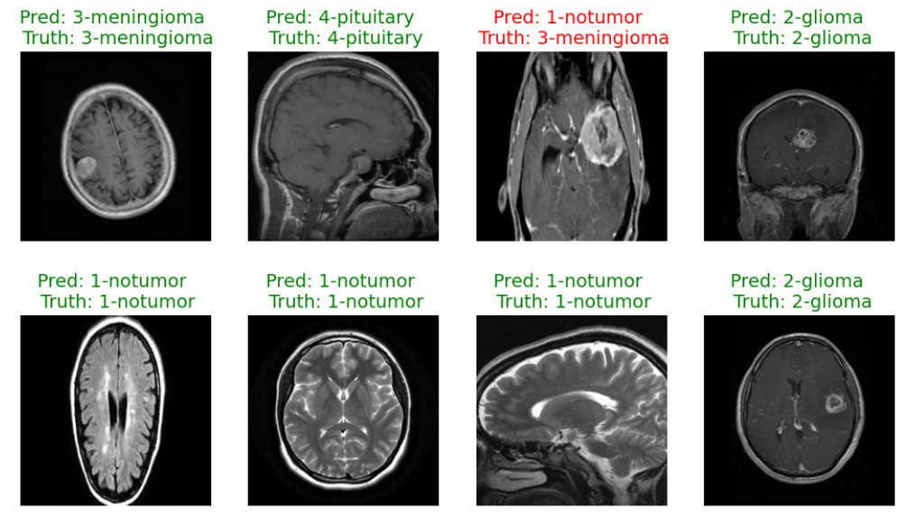
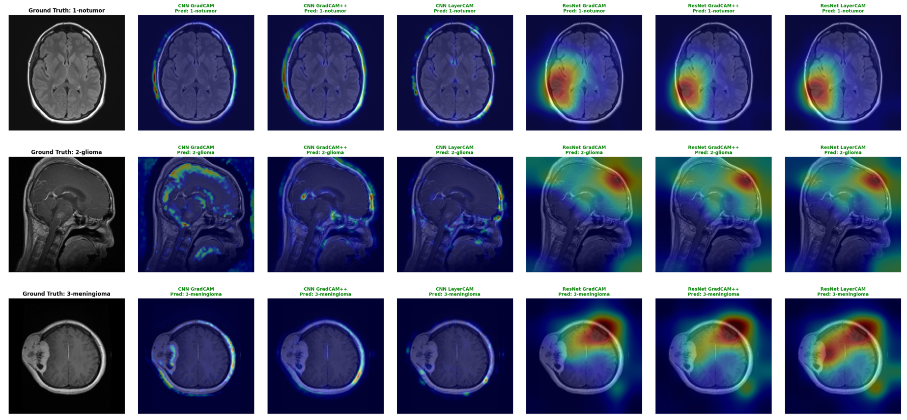
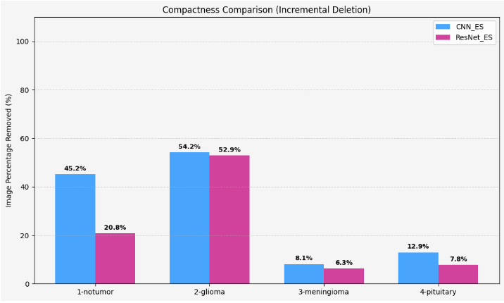

# Tell Me Why – MRI Tumor Classification with CNN & ResNet50
This repository contains the implementation of deep learning models for the classification of brain MRI images into four diagnostics categories: 
- No tumor
- Glioma
- Meningioma
- Pituitary tumor

The main objective is to compare two different deep learning architectures (CNN and ResNet50) for medical image classification and analyze their interpretability using Grad-CAM based explainability techniques.

## Project Overview
The workflow of the project consists of four main stages:
1. Exploratory Data Analysis (EDA)
2. Model training and comparison
3. Explainability analysis using GradCAM
4. Quantitative evaluation of explanation methods

Two architectures were implemented and compared:
- A custom Convolutional Neural Network (CNN)
- A pretrained ResNet50 model
Both models were trained with and without early stopping, in order to evaluate the effect of training regularization on performance and computational efficiency. The final comparison considers both classification accuracy and explainability metrics, identifying the most reliable model for tumor detection.Particular attention is given to minimizing false negatives, i.e., cases in which a tumor is incorrectly classified as no tumor, due to their critical impact in clinical settings.

<p align="center">
  
</p>

## Project Structure
The repository contains the following files:
- ```python CNN.py ```: CNN model implementation
- ```python ResNet50.py ``` : ResNet50 model implementation
- ```python __init__.py ```: package initialization
- ```python data_utils.py ```: custom MRIDataset class and dataset utilities
- ```python utils.py ```: training, evaluation, visualization and utility functions
- ```python final_main_brain_colab.py ```: main notebook to run the complete pipeline
- ```python requirement.txt ```: required Python dependencies

## Dataset 
The dataset used is: Simezu/brain-tumour-MRI-scan from HuggingFace. It is automatically downloaded via the HuggingFace datasets library inside ```python utils.py ```. Before running the project, you must specify your HuggingFace token. Inside ```python utils.py ```, the dataset is loaded using:
```python
my_token = os.getenv("HF_TOKEN")
dataset = load_dataset('Simezu/brain-tumour-MRI-scan', token=my_token)
```
You must therefore define your HuggingFace token as an environment variable:
On macOS/Linux: 
```bash
export HF_TOKEN="your_token_here"
```
On Windows: 
```bash
set HF_TOKEN=your_token_here
```
Alternatively, you may modify the token definition directly inside utils.py (not recommended for security reasons). Without this step, dataset loading will fail.

## Models 
### CNN 
Custom convolutional neural network trained from scratch. Training configuration:
- Epochs: 30
- Batch size: 128
- Optimizer: SGD
- Learning rate: 0.001
- Loss function: CrossEntropyLoss

Two versions were trained:
- With Early Stopping (patience = 5)
- Without Early Stopping

Early stopping reduced computational cost while maintaining equivalent performance.

### ResNet50
Pre-trained ResNet50 architecture adapted for 4-class classification. Two training strategies:
1. Standard training (same parameters as CNN)
2. Extended training with Early Stopping: epochs: 70 and patience: 20

The early stopping version demonstrated:
- Better generalization
- Reduced overfitting
- Fewer false negatives
- More stable training curves

## Performance Evaluation 
The following evaluation tools are implemented:
1. Metrics: accuracy, loss, multiclass AUROC, Confusion Matrix
2. Visualization: Training & testing loss curves, Accuracy curves, ROC curves, prediction grid visualization
Special focus is placed on:
- False negatives (tumor classified as no tumor)
- Confusion between glioma and meningioma

<p align="center">
  
   
</p>

## Explainability - GradCAM Analysis 
Grad-CAM (Gradient-weighted Class Activation Mapping) is an explainability technique used to visualize which regions of an input image contribute most to a model’s prediction. It computes the gradients of the predicted class score with respect to the feature maps of a convolutional layer and uses them to generate a heatmap highlighting the most relevant areas. In this project, Grad-CAM is used to verify whether the models focus on meaningful tumor regions in brain MRI images, improving interpretability and supporting the reliability of the classification results in a clinical context.

<p align="center">
  
</p>

## Quantitative Explainability Evaluation 
Two sanity analyses were conducted: 
### Model Parameters Randomization Check 
Weights were randomly perturbed and heatmap correlation was computed. Lower correlation (in absolute value) indicates better behavior. ResNet50 showed stronger robustness.
### Incremental Deletion 
Pixels were removed in order of importance. The probability of correct classification dropped as relevant pixels were deleted. Findings:
- Glioma and meningioma are the most frequently confused classes.
- No-tumor predictions are more stable.
- ResNet50 shows better compactness and feature sensitivity.

<p align="center">
  
</p>

<p align="center">
  
</p>

# How to Run the Project 
1. Install dependencies
   ```bash
   pip install -r requirements.txt
   ````
3. Set your HuggingFace token
4. Open and run
   ```bash
   final_main_brain_colab.ipynb
   ```` 
   The notebook contains:
   - dataset loading
   - preprocessing
   - model training
   - evaluation
   - GradCAM analysis
   - quantitative explainability metrics

# Authors 
Neuroengineering 2025-2026, Francesco Cazzaniga, Pietro Dell'Acqua, Maria Vittoria Sari, Camilla Zago
